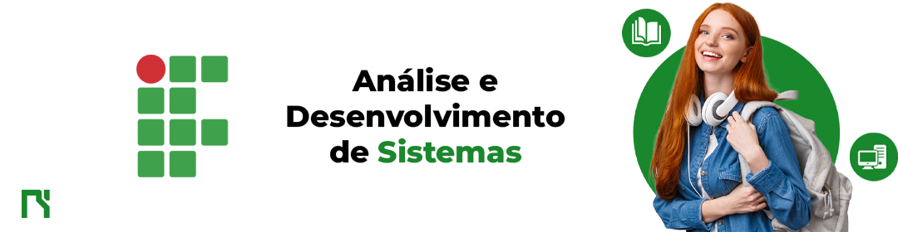

<h1 class="titulo">Redesign Site IFPB</h1>

O presente projeto foi desenvolvido junto com uma equipe de três integrantes, com o intuito de criar um redesign do site institucional do IFPB. Durante o desenvolvimento foi priorizado o uso de tecnologias como HTML e CSS. O Design foi desenvolvido totalmente utilizando o Figma e projetado utilizado tecnicas de desenvolvimento pelo github como criação de branchs e gitflow.

 
<h2 class="subtit">🙏‍ - Equipe do projeto</h2>
 
<ul>
    <li><a href="https://github.com/AntLacerda">Antonio Lacerda</a></li>
    <li><a href="https://github.com/AntonioMarcosDev">Antonio Marcos</a></li>
    <li><a href="https://github.com/GuiiAbreu">Guilherme Henrique</a></li>
</ul>
 
<h2>👷‍ - Habilidades Desenvolvidas</h2>
 

✅ Desenvolvimento de layout moderno

✅ Métricas de desenvolvimento pelo Github

✅ CSS Moderno

✅ Métodos de trabalho em equipe

 
<h2>🛠 - Tecnologia Utilizadas</h2>
 

    
    
    
    

 
<h2>🎨 - Protótipo</h2>
 
<ul>
    <li>Acesse o protótipo do figma <a href="https://www.figma.com/file/sbOr5Lil4fsh6yfa5z3Zg7/Projeto-Final---Gerencia-de-Controle?node-id=1%3A2&t=FPHEbSGgJolvqGdc-1">aqui</a>.</li>
</ul>
 
<h2>🔗 - Deploy</h2>
 

Acesse o projeto desenvolvido por mim através deste <a href="https://wgirnz.csb.app/">link</a>.
